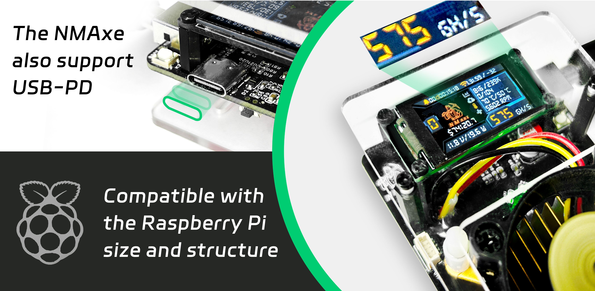
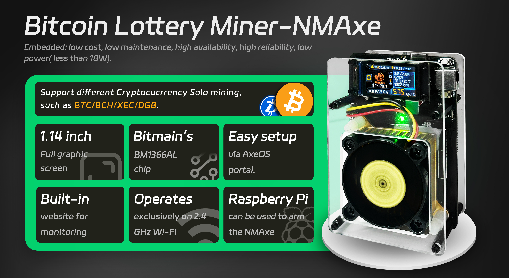
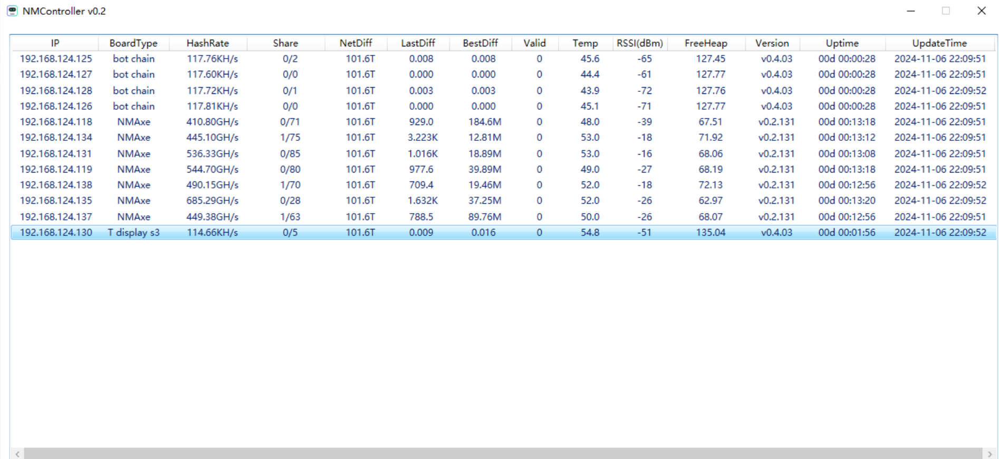
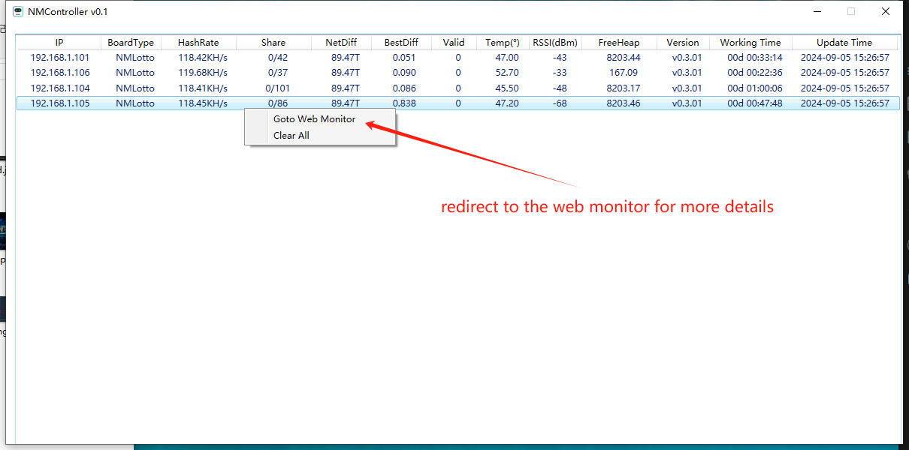
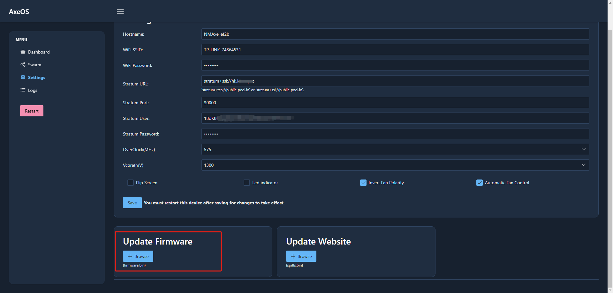
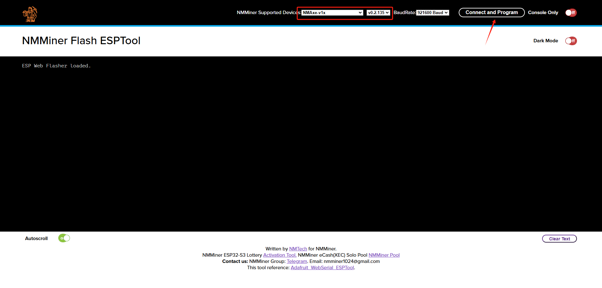

  <h1>Join a global block game!</h1>

# NMAxe
***
- NMAxe solo miner based on BM1366 which fork from [bitaxe](https://github.com/skot/bitaxe).
- NMAxe [aliexpress](https://www.aliexpress.com/item/1005008053561633.html)

  <table width="100%">
    <tr>
      <td width="50%" align="center"></td>
      <td width="50%" align="center"></td>
    </tr>
  </table>

## Build requirements
***
| Platform           | framework  | PCB     | Firmware                     |
| :---------------   | :---------:|:-------:|:----------------------------:|
|espressif32@6.6.0   |    Arduino |JLC EDA  | VS code with platformio      |

## Features
***
- **ESP32S3R8 wifi connection**
- **Stratum with ssl connection**
- **USB PD power supply support**
- **Raspberry Pi5 structure compatible**
- **User-friendly UI with a 1.14-inch TFT LCD driven by LVGL**
- **Low cost Vcore regulator solution**
- **Vcore adjustment without restart**
- **A more accurate way for calculating hashrate**
- **Dynamically adjust ASIC difficulty threshold**
- **[One click deployment](https://flash.nmminer.com/)**
- **[NMController_client](https://github.com/NMminer1024/NMController_client) monitor**.
- **[NMController_web](https://github.com/NMminer1024/NMController_web) monitor**.

### Buttons
***
| Buttons           | Action             | Description             |
| :---------------  | :-----------------:|:-----------------:      |
|boot               |    Double click    |  Switch to next page    |
|boot               |    Long press      |  Force configuration    |
|user               |    Long press      |  Restore to factory settings  |

### Power 
- DC adapter 8-12v/25W at least.
- USB PD charger 25W at least. 

### Configuration
***
## Pool
| Url               | Type               | Port               | Description       | Minimum required difficulty|
| :---------------  | :-----------------:| :-----------------:|:-----------------:| :----------------------:   |
|public-pool.io     | tcp                |    21496           |        BTC        | 1M initial, Minimum 0.001  |
|solo.ckpool.org    | tcp                |    3333            |        BTC        | 10K initial, dynamically adjusted based on hashrate|
|pool.nmminer.com   | tcp                |    3333            |        XEC        | 1K initial, dynamically adjusted based on hashrate |
|eu.molepool.com    | tcp                |    7450            |        DGB        | Minimum 32.768K constantly         |
|eu.molepool.com    | tcp                |    5566            |        BCH        | Minimum 32.768K constantly         |
|eu.molepool.com    | tcp                |    2566            |        SPACE      | Minimum 32.768K constantly         |
|eu2.molepool.com   | tcp                |    1801            |        FB         | Minimum 32.768K constantly         |

## How to monitor
- In fact, both ***NMController_client*** and ***NMController_web*** have the same feature, ***NMController_client*** for Windows, ***NMController_web*** for Windows and MACOS, We make an example by ***NMController_client*** here.

- ***NMController_client***, scan the machine in your LAN, just as below.

  

- Redirect to the web monitor for more details. 

  

## Firmware update
***
- *Via AxeOS ota*

  

- *Via [NMMiner flash tool](https://flash.nmminer.com/)*
***Notice***：Long press and hold **boot** button，then click **reset** button to let the NMAxe force into bootloader mode, So that the computer will recognize a COMx device plug in.

  

## TODO
- According to different mining coin, the corresponding market prices are displayed.

## Contact
- Anything do not work as your expectation, just let us know.

| Email                   |  Telegram                       | Home page           |
| :-----------------:     |  :-----------------:            |:-----------------:  |
|nmminer1024@gmail.com    |  https://t.me/NMAxe1024         |[NMTech](https://www.nmminer.com/) |

## Release Log
***

### (2024.11.30) - v2.1.15
- Add:
  - None.
- Fixed:
  - Order of vcore settle.
  - DNS issue.
- Improved:
  - None.
- Modify:
  - Danger temp.

### (2024.11.25) - v2.1.14
- Add:
  - None.
- Fixed:
  - Soft AP name issue.
- Improved:
  - None.
- Modify:
  - None.

### (2024.11.13) - v2.1.13
- Add:
  - None.
- Fixed:
  - ASIC not found reboot issue.
- Improved:
  - None.
- Modify:
  - Led indicator enable default.
  - Overclock 575Mhz and Vcore 1300mV default.
  - Fan self-test threshold changed to 4800 rpm.

### (2024.11.13) - v2.1.12
- Add:
  - None.
- Fixed:
  - None.
- Improved:
  - None.
- Modify:
  - Vcore bias set to 10mV.

### (2024.11.13) - v2.1.11
- First push.
- Checkout NMAxe branch.

