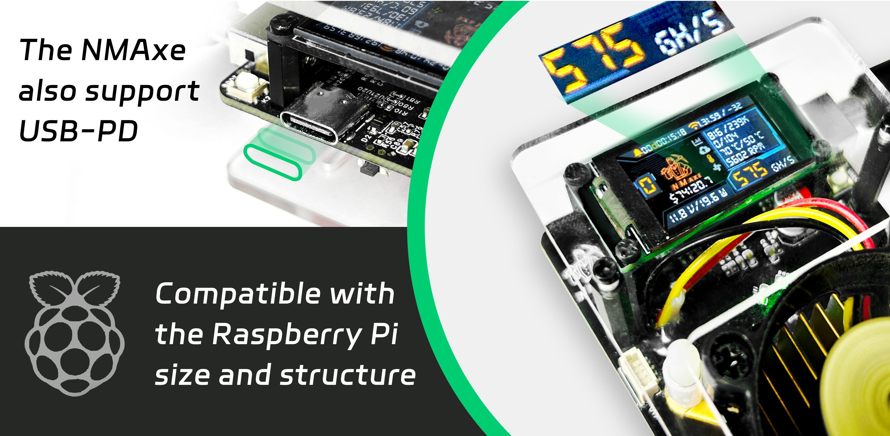
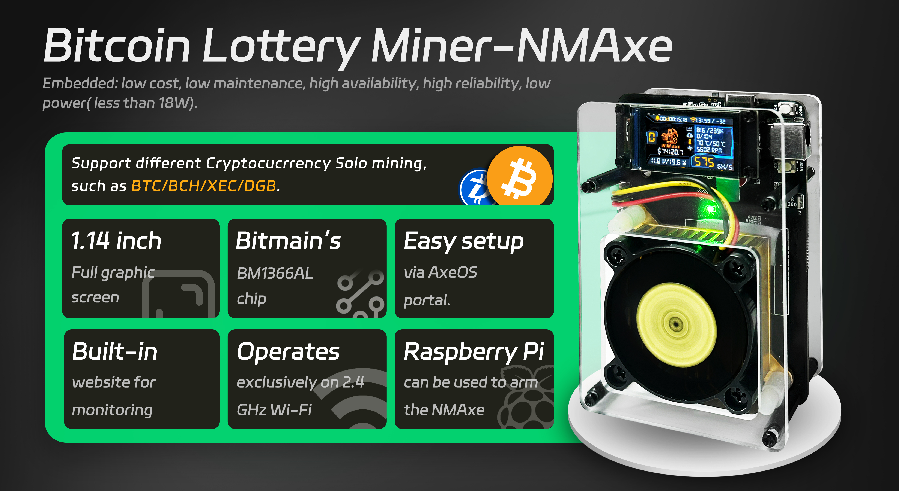
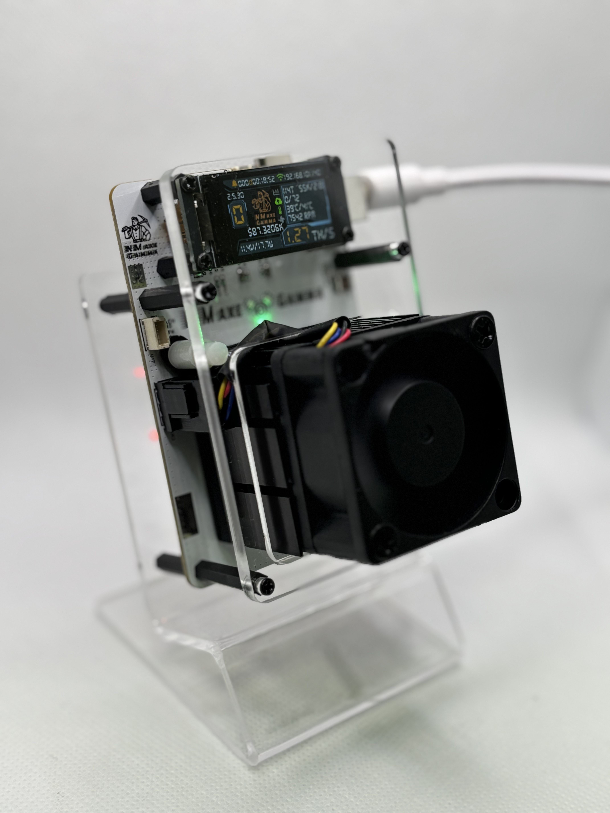
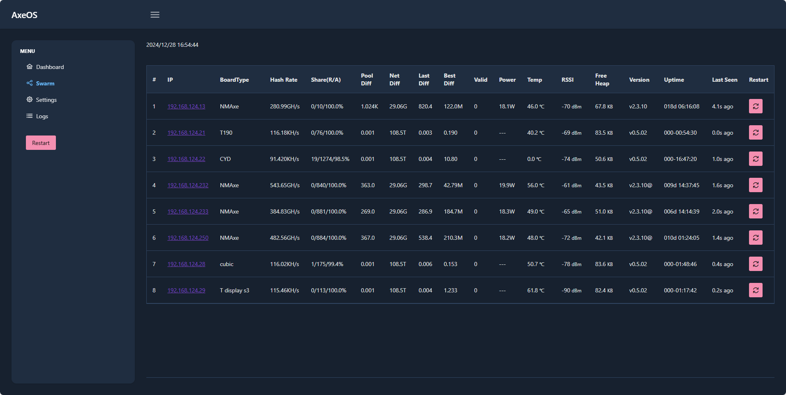
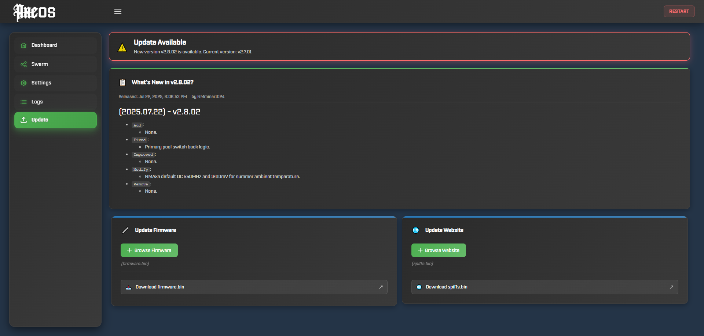
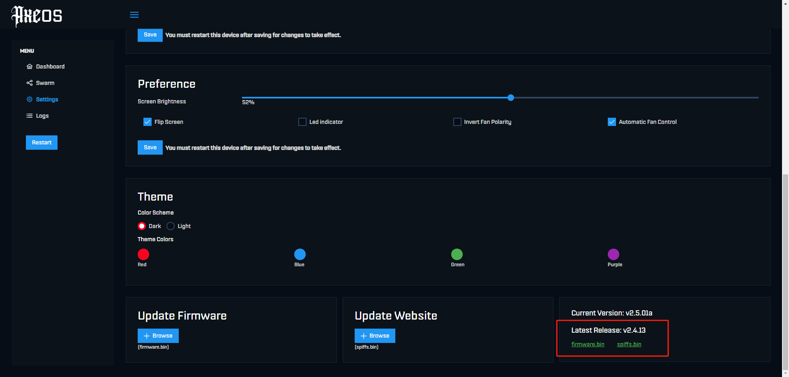
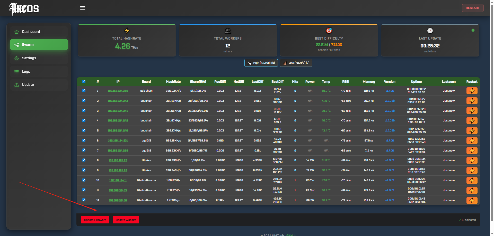
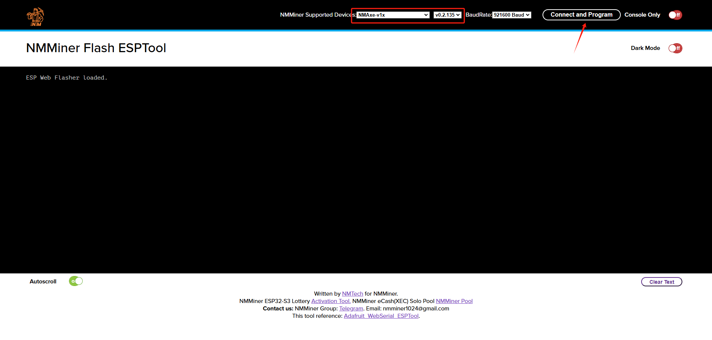

  <h1>Make it better</h1>

## NMAxe
***
- NMAxe and NMAxeGamma solo miner based on BM1366 and BM1370 which fork from [bitaxe](https://github.com/skot/bitaxe), hashrate around 450-550GH/s and 1.2-2.0TH/s.
- NMAxe [aliexpress](https://www.aliexpress.com/item/1005008053561633.html)

  <table width="100%">
    <tr>
      <td width="50%" align="center"></td>
      <td width="50%" align="center"></td>
    </tr>
  </table>

  <table width="100%">
    <tr>
      <td width="50%" align="center"></td>
      <td width="50%" align="center"></td>
    </tr>
  </table>

## Tutorial
***
- [NMTech YouTube Channel](https://www.youtube.com/@NMTech-official)

## Build requirements
***
| Platform           | framework  | PCB     | Firmware                     |
| :---------------   | :---------:|:-------:|:----------------------------:|
|espressif32@6.6.0   |    Arduino |JLC EDA  | VS code with platformio      |

## Features
***
- **SHA256d algorithm**
- **ESP32S3R8 wifi connection**
- **Stratum with ssl connection optional**
- **USB PD power supply support**
- **Raspberry Pi5 structure compatible**
- **User-friendly UI with a 1.14-inch TFT LCD driven by LVGL**
- **Low cost Vcore regulator solution**
- **Vcore adjustment without restart**
- **A more accurate way for calculating hashrate**
- **Dynamically adjust ASIC difficulty threshold**
- **[One click deployment](https://flash.nmminer.com/)**
- **[NMController_client](https://github.com/NMminer1024/NMController_client) monitor**.
- **[NMController_web](https://github.com/NMminer1024/NMController_web) monitor**.

## Buttons
***
| Buttons           | Action             | Description             |
| :---------------  | :-----------------:|:-----------------:      |
|boot               |    Double click    |  Screen and led sleep   |
|boot               |    Single click    |  Switch to next page    |
|boot               |    Long press      |  Force configuration    |
|user               |    Long press      |  Restore to factory settings  |

## Power 
### NMAxe
- DC adapter 8-12v/25W at least.
- USB PD charger 25W at least. 
### NMAxeGamma
- DC adapter 8-12v/40W at least.
- USB PD charger 40W at least. 

## Configuration
***

### Solo
| Url               | Type               | Port               | Description       | Minimum required difficulty|
| :---------------  | :-----------------:| :-----------------:|:-----------------:| :----------------------:   |
|public-pool.io     | tcp                |    21496           |        BTC        | 1M initial, Minimum 0.001  |
|solo.ckpool.org    | tcp                |    3333            |        BTC        | 10K initial, dynamically adjusted based on hashrate|
|pool.nmminer.com   | tcp                |    3333            |        XEC        | 1K initial, dynamically adjusted based on hashrate |
|eu.molepool.com    | tcp                |    7450            |        DGB        | Minimum 32.768K constantly         |
|eu.molepool.com    | tcp                |    5566            |        BCH        | Minimum 32.768K constantly         |
|eu.molepool.com    | tcp                |    2566            |        SPACE      | Minimum 32.768K constantly         |
|eu2.molepool.com   | tcp                |    1801            |        FB         | Minimum 32.768K constantly         |

### Pool(v2.2.xx at least)
| Url               | Type               | Port               | Description       | Region|
| :---------------  | :-----------------:| :-----------------:|:-----------------:| :----------------------:   |
|btc.f2pool.com     | tcp                |    1314            |        BTC        | common  |
|btc-asia.f2pool.com| tcp                |    1314            |        BTC        | Asia    |
|btc-na.f2pool.com  | tcp                |    1314            |        BTC        | North America|
|btc-euro.f2pool.com| tcp                |    1314            |        BTC        | Europe|
|btc-africa.f2pool.com| tcp              |    1314            |        BTC        | Africa|
|btc-latin.f2pool.com| tcp               |    1314            |        BTC        | Latin|

## How to monitor

- *Swarm*

  

## Firmware update
- *Via AxeOS ota*

Check the latest **firmware.bin** and **spiffs.bin**.

  

Download the latest **firmware.bin** and **spiffs.bin** file.

  

Batch firmware update on swarm page.

  

- *Via [NMMiner flash tool](https://flash.nmminer.com/)*

***Notice***：Long press and hold **boot** button，then click **reset** button to let the NMAxe force into bootloader mode, So that the computer will recognize a COMx device plug in.

  

## Contact
- Anything do not work as your expectation, just let us know.

| Email                   |  Telegram                       | Home page           |
| :-----------------:     |  :-----------------:            |:-----------------:  |
|nmminer1024@gmail.com    |  https://t.me/NMAxe1024         |[NMTech](https://www.nmminer.com/) |

## Release Log
***

### (2025.05.17) - v2.6.01
- `Add`:
  - None.
- `Fixed`:
  - Auto fan logic.
- `Improved`:
  - None.
- `Modify`:
  - NMaxe-Gamma default Setting 595Mhz/1125mV.
- `Remove`:
  - softAP password.

### (2025.05.11) - v2.5.51
- `Add`:
  - None.
- `Fixed`:
  - None.
- `Improved`:
  - None.
- `Modify`:
  - Default Setting 600Mhz/1125mV.
  - Clear Extra2 every job receive.
  - Default difficulty for BM1366 set to 256, BM1370 to 512.

### (2025.04.03) - v2.5.50
- Add:
  - None.
- Fixed:
  - Restart button inactive on AxeOS when QR code appear.
- Improved:
  - None.
- Modify:
  - ASIC danger temp.
  - boot button logic: single click -> page switch,  double click -> screen and led sleep.

### (2025.03.30) - v2.5.41
- Add:
  - None.
- Fixed:
  - Fan self test bug.
  - Restart button inactive on AxeOS when miner loading.
- Improved:
  - None.
- Modify:
  - None.

### (2025.03.26) - v2.5.31
- Add:
  - None.
- Fixed:
  - Fallback pool issues.
- Improved:
  - Real time log.
- Modify:
  - None.

### (2025.03.22) - v2.5.30
- Add:
  - Benchmark support.
- Fixed:
  - Default settings with BM1366 and BM1730.
- Improved:
  - Real time log.
- Modify:
  - Default wallet address pad with worker name.

### (2025.03.05) - v2.5.20
- Add:
  - Batch firmware upgrade on swarm page.
  - BM1370 class.
- Fixed:
  - AxeOS compatible NMAxe and NMAxe-Gamma.
- Improved:
  - Swarm.
- Modify:
  - None.

### (2025.02.13) - v2.5.10
- Add:
  - BSV,FB,SPACE price.
- Fixed:
  - NMAxe will reboot when refresh the AxeOS frequently.
- Improved:
  - Swarm.
- Modify:
  - Stratum password to text type.
  - NMAxe and NMAxe-Gamma board select pin.

### (2025.01.30) - v2.5.02
- Add:
  - Stratum user for primary and fallback.
- Fixed:
  - None.
- Improved:
  - Swarm.
- Modify:
  - None.

### (2025.01.25) - v2.5.01
- Add:
  - Fallback pool.
- Fixed:
  - Swarm issues.
- Improved:
  - AxeOS follow 'skot' version, theme preference option for user. (clear your browser cache after firmware update)
  - The primary pool will back to 'public-pool.io' after you update this version, just change it as you want. 
  - Display the IP of the NMAxe on the loading page. Even if the NMAxe is stuck on the loading page, you can log in to the device through the IP.
- Modify:
  - In order to compatible noctua fan,Fan self test min rpm from 4800 to 4200.

### (2025.01.22) - v2.4.13
- Add:
  - Market price support BTC, BCH, XEC, DGB.
- Fixed:
  - Pool connection timeout.
  - Stratum waiting response issue.
- Improved:
  - System stable.
  - Swarm.
- Modify:
  - Disable IP scroll on NMAxe.

### (2025.01.19) - v2.4.12
- Add:
  - Column sort feature for swarm.
  - Summary of swarm list.
- Fixed:
  - None
- Improved:
  - BM1366 class.
- Modify:
  - Input voltage danger threshold to 5v. 

### (2025.01.09) - v2.4.11
- Add:
  - None
- Fixed:
  - None
- Improved:
  - Swarm.
- Modify:
  - ssl default in first flash for test in BTC banned region, tcp connection once long press user button.

### (2025.01.03) - v2.4.10
- Add:
  - Latest firmware check on AxeOS.
- Fixed:
  - Restart issue.
- Improved:
  - None.
- Modify:
  - None.

### (2024.12.31) - v2.3.20
- Add:
  - None.
- Fixed:
  - Hashrate on pool drop to zero.
- Improved:
  - Stability.
  - Pretty log in AxeOS.
- Modify:
  - Order of session uptime and total uptime. 
  - Swarm support 60 devices.

### (2024.12.18) - v2.3.10
- Add:
  - Share latency.
  - Swarm list.
  - Hashrate real time page on NMAxe.
- Fixed:
  - CPU1 wtd restart issue.
  - Auto fan issue.
  - Low power and hashrate expect issue.
- Improved:
  - Increase share accept rate.
- Modify:
  - Hashrate on 3m, 5m, 60m.

### (2024.12.18) - v2.2.23
- Add:
  - None.
- Fixed:
  - Stratum user issues.
- Improved:
  - Increase share accept rate.
- Modify:
  - None.

### (2024.12.14) - v2.2.22
- Add:
  - Hashrate real time page.
  - Screen brightness adjustment.
- Fixed:
  - Restart issues.
- Improved:
  - None.
- Modify:
  - None.

### (2024.12.08) - v2.2.11
- Add:
  - Pool mining support.
  - Local dashboard.
  - Local hashrate healthy page.
- Fixed:
  - None.
- Improved:
  - None.
- Modify:
  - None.

### (2024.11.30) - v2.1.15
- Add:
  - None.
- Fixed:
  - Order of vcore settle.
  - DNS issue.
- Improved:
  - None.
- Modify:
  - Danger temp.

### (2024.11.25) - v2.1.14
- Add:
  - None.
- Fixed:
  - Soft AP name issue.
- Improved:
  - None.
- Modify:
  - None.

### (2024.11.13) - v2.1.13
- Add:
  - None.
- Fixed:
  - ASIC not found reboot issue.
- Improved:
  - None.
- Modify:
  - Led indicator enable default.
  - Overclock 575Mhz and Vcore 1300mV default.
  - Fan self-test threshold changed to 4800 rpm.

### (2024.11.13) - v2.1.12
- Add:
  - None.
- Fixed:
  - None.
- Improved:
  - None.
- Modify:
  - Vcore bias set to 10mV.

### (2024.11.13) - v2.1.11
- First push.
- Checkout NMAxe branch.

