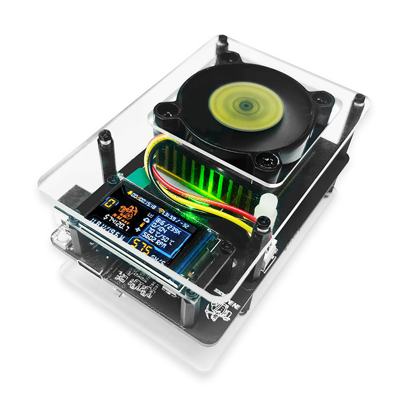
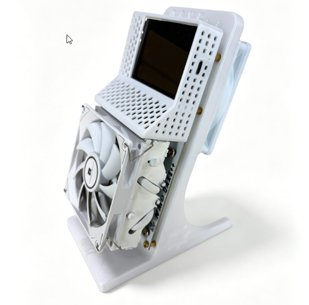
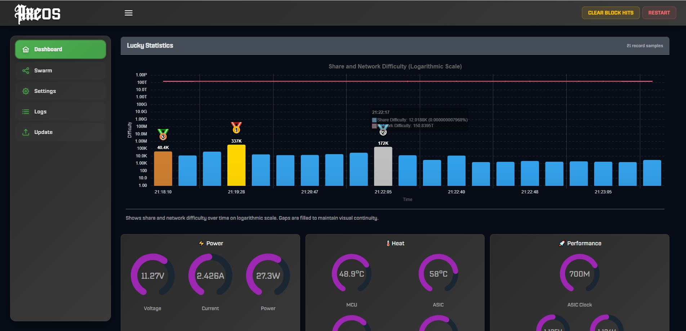
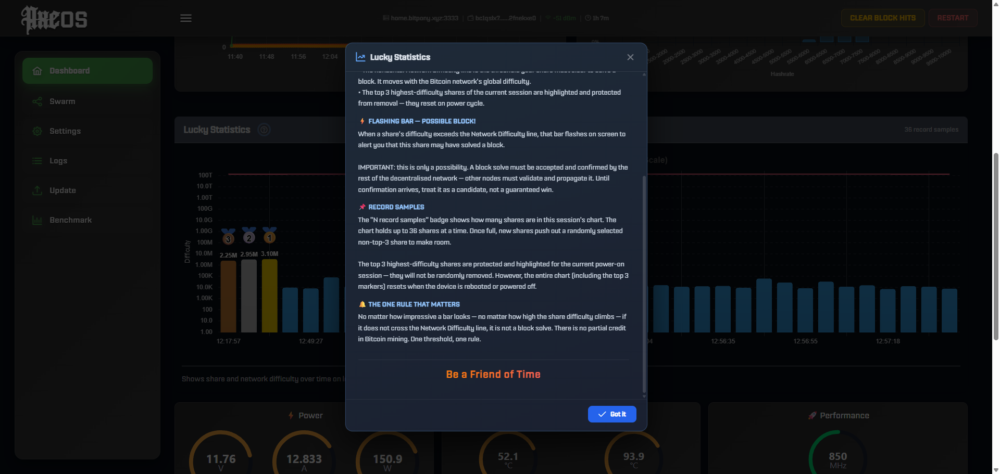
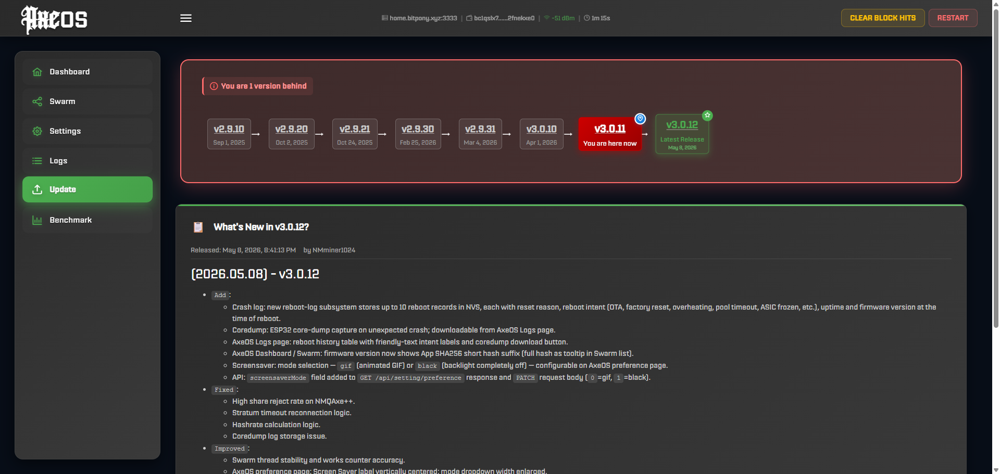

  <h1>Make it better</h1>

## Overview
***
NMAxe series are ESP32-S3 based Bitcoin solo miners forked from [bitaxe](https://github.com/skot/bitaxe), featuring a built-in color TFT display, AxeOS web interface, and swarm management. Three models are available:

  <table width="100%">
    <tr>
      <td width="33%" align="center"></td>
      <td width="33%" align="center"></td>
      <td width="33%" align="center"></td>
    </tr>
    <tr>
      <td align="center"><a href="https://www.nmminer.com/product/nmaxe/">🛒 NMAxe</a></td>
      <td align="center"><a href="https://www.nmminer.com/product/nmaxe-gamma/">🛒 NMAxeGamma</a></td>
      <td align="center"><a href="https://www.nmminer.com/product/nmqaxe/">🛒 NMQAxe++</a></td>
    </tr>
  </table>

## Features
***

| Feature | NMAxe | NMAxeGamma | NMQAxe++ |
| :--- | :---: | :---: | :---: |
| **ASIC Chip** | BM1366 × 1 | BM1370 × 1 | BM1370 × 4 |
| **Hashrate** | ~450–550 GH/s | ~1.2–2.0 TH/s | ~4.8–7.3 TH/s |
| **Default OC** | 575 MHz / 1250 mV | 600 MHz / 1125 mV | 600 MHz / 1150 mV |
| **Display** | 1.14" TFT 240×135 | 1.14" TFT 240×135 | 2.8" TFT 320×240 |
| **Touch** | ❌ | ❌ | ✅ |
| **Fan** | Single | Single | Dual (ASIC + Vcore) |
| **USB PD** | ✅ | ✅ | ❌ |
| **Power Supply** | DC 8–12V / 25W+ or USB PD 25W+ | DC 8–12V / 40W+ or USB PD 40W+ | DC 12V / 120W+ |
| **Screensaver** | ✅ | ✅ | ✅ |
| **Algorithm** | SHA256d | SHA256d | SHA256d |
| **Stratum SSL** | ✅ | ✅ | ✅ |
| **[One-click Flash](https://flash.nmminer.com/)** | ✅ | ✅ | ✅ |

## Button Controls
***
| Button | Action | Description |
| :--- | :---: | :--- |
| boot | Single click | Switch to next page |
| boot | Double click | Back to previous page |
| boot | Long press | Force configuration mode |
| user | Long press | Restore factory settings *(NMAxe / NMAxeGamma only)* |

## Pool Configuration
***

### Solo Mining
| URL | Port | Coin | Min Difficulty |
| :--- | :---: | :---: | :--- |
| solobtc.nmminer.com | 3333 | BTC | 0.001 |
| au.solobtc.nmminer.com | 3333 | BTC | 0.001 |
| solo.ckpool.org | 3333 | BTC | 10K (auto-adjusted) |
| pool.nmminer.com | 3333 | XEC | 1K (auto-adjusted) |
| eu.molepool.com | 7450 | DGB | 32.768K |
| eu.molepool.com | 5566 | BCH | 32.768K |
| eu.molepool.com | 2566 | SPACE | 32.768K |
| eu2.molepool.com | 1801 | FB | 32.768K |

### Pool Mining *(v2.2.xx or later)*
| URL | Port | Coin | Region |
| :--- | :---: | :---: | :---: |
| btc.f2pool.com | 1314 | BTC | Global |
| btc-asia.f2pool.com | 1314 | BTC | Asia |
| btc-na.f2pool.com | 1314 | BTC | North America |
| btc-euro.f2pool.com | 1314 | BTC | Europe |
| btc-africa.f2pool.com | 1314 | BTC | Africa |
| btc-latin.f2pool.com | 1314 | BTC | Latin America |

## Monitoring
***
The AxeOS web interface provides real-time monitoring. The **Swarm** page lets you manage multiple miners from a single view; the **Lucky Statistics** chart tracks your solo mining progress over time.

  <table width="100%">
    <tr>
      <td width="50%" align="center"></td>
      <td width="50%" align="center"></td>
    </tr>
    <tr>
      <td align="center">Swarm &mdash; multi-device dashboard</td>
      <td align="center">Lucky Statistics</td>
    </tr>
  </table>

## What's this

Most cards in the AxeOS web interface have a small **"?"** button in its title bar. Tap it to open a contextual help overlay explaining what each setting does, what the numbers mean, and how to get the best results from your miner — no need to leave the page.

  

## Firmware Update
***

### Via AxeOS OTA
Download the latest **firmware.bin** and **spiffs.bin** from the [Releases](https://github.com/NMminer1024/ESP-Miner-NMAxe/releases) page, then upload via the AxeOS Update menu. Batch OTA upgrade is also supported from the Swarm page.

  <table width="100%">
    <tr>
      <td width="50%" align="center"></td>
      <td width="50%" align="center"></td>
    </tr>
    <tr>
      <td align="center">Single device OTA</td>
      <td align="center">Batch OTA via Swarm</td>
    </tr>
  </table>

### Via [NMMiner Flash Tool](https://flash.nmminer.com/)
Use the web-based flash tool for first-time flashing or to recover a bricked device.

**Enter flash mode:**
1. Hold the `boot` button
2. Plug in the USB cable (or click `reset` if already connected)
3. Release the `boot` button

The browser will detect the device and flash the latest firmware directly.

  

## API Reference
***
Full REST API documentation: [docs/API.md](./docs/API.md)

> An interactive version is also available on-device at `http://{device-ip}/api-doc` after flashing.

## Build from Source
***
| Platform | Framework | PCB | IDE |
| :--- | :---: | :---: | :--- |
| espressif32 @ 6.6.0 | Arduino | JLC EDA | VS Code + PlatformIO |

Video tutorial: [NMTech YouTube Channel](https://www.youtube.com/@NMTech-official)

## Contact
***
| Email | Telegram | Home Page |
| :---: | :---: | :---: |
| nmminer1024@gmail.com | https://t.me/NMAxe1024 | [NMTech](https://www.nmminer.com/) |

## Release Log
***

### (2026.05.22) - v3.0.20
- `Add`:
  - **NMQAxe++ Rev6.1**: new hardware revision with higher power headroom; hashrate up to ~7.3 TH/s. Default OC 750 MHz / 1250 mV.
  - **Offline Benchmark**: full Freq × Vcore grid sweep running entirely on-device — warmup + sampling phases, per-point hashrate / power / temperature records, NVS persistence (LRU eviction when full), resume-across-reboot, and a one-click "Apply Best" button. Results survive factory reset.
  - **Benchmark Overlay**: dedicated full-screen benchmark status overlay for NMQAxe++ large display (F/V/P/Temp layout, progress, ETA).
  - **AxeOS Help System**: "What's this?" overlay available on every major card (Benchmark, Mining settings, Pool, Hashrate, Lucky Statistics, ASIC, Logs, Swarm, etc.) with detailed contextual descriptions.
  - **Swarm Scan Progress**: live scanning progress bar and count on the Swarm page during device discovery.
  - **AxeOS UI improvements**: RSSI signal bars, uptime display, improved Logs page (log level coloring, auto-scroll), benchmark time-cost display, GIF reminder fixes.
  - **TMP102 self-test** on boot process.
  - **Nonce deduplication** check for REV6.1.
  - `displayName` field in `GET /api/system/info` API response.
- `Fixed`:
  - Screen saver crash (LVGL timer dangling pointer).
  - Auto-roll crash on enable.
  - BMxx HAL `get_board_model` fix.
  - Benchmark logic correctness (threshold 0.9, thread restore).
  - Reactive button color binding in benchmark UI.
  - Benchmark overlay button severity binding.
  - `subscribe` lifecycle leak in AxeOS components.
  - Share reject reason now logged per-share.
  - AxeOS fit / layout for QAxe++ Rev6.1 display name.
- `Improved`:
  - Custom NVS freq/vcore values (e.g. from Benchmark Apply) shown in device display and AxeOS Mining dropdowns at their correct sorted position, marked with `*` (e.g. `"450 MHz*"`, `"1175 mV*"`).
  - Fan self-test logic.
  - Benchmark ETA calculation.
  - Board detection logic.
  - NVS usage logging.
  - AxeOS help text: Mining card notes that `*`-marked values are Benchmark-applied custom settings.
  - API documentation (`docs/API.md` and on-device `api-doc`) fully synced with backend: added `minFreeHeap`, `/alive` scanning fields, Reboot History / Coredump / Benchmark endpoint sections.
  - **NMQAxe++ Vcore temperature source** corrected: now reads from the VRM's internal sensor (previously from an external sensor, which under-reported). Expect displayed Vcore temp to be **10–20 °C higher** after upgrading — anything below **125 °C** is normal.
- `Remove`:
  - None.

### (2026.05.08) - v3.0.12
- `Add`:
  - Crash log: new reboot-log subsystem stores up to 10 reboot records in NVS, each with reset reason, reboot intent (OTA, factory reset, overheating, pool timeout, ASIC frozen, etc.), uptime and firmware version at the time of reboot.
  - Coredump: ESP32 core-dump capture on unexpected crash; downloadable from AxeOS Logs page.
  - AxeOS Logs page: reboot history table with friendly-text intent labels and coredump download button.
  - AxeOS Dashboard / Swarm: firmware version now shows App SHA256 short hash suffix (full hash as tooltip in Swarm list).
  - Screensaver: mode selection — `gif` (animated GIF) or `black` (backlight completely off) — configurable on AxeOS preference page.
  - API: `screensaverMode` field added to `GET /api/setting/preference` response and `PATCH` request body (`0`=gif, `1`=black).
- `Fixed`:
  - High share reject rate on NMQAxe++.
  - Stratum timeout reconnection logic.
  - Hashrate calculation logic.
  - Coredump log storage issue.
- `Improved`:
  - Swarm thread stability and works counter accuracy.
  - AxeOS preference page: Screen Saver label vertically centered; mode dropdown width enlarged.
- `Modify`:
  - None.
- `Remove`:
  - None.

### (2026.04.24) - v3.0.11
- `Add`:
  - None.
- `Fixed`:
  - PSRAM exhaustion causing random restarts after long uptime; history node data type optimized and hard cap added.
  - lwIP `assert(q==NULL)` crash in LAN scan caused by ARP table race condition.
  - WiFi reconnection logic.
  - Market HTTP timeout causing watchdog restart.
  - Network connection timeout.
  - Stratum readline timeout logic.
  - Swarm total hashrate calculation error.
  - Swarm Restart button CORS issue.
  - Achievement page display issue.
- `Improved`:
  - Swarm OTA batch upgrade stability.
  - Swarm filter by device model.
  - Swarm Restart button now handles errors and shows result feedback.
  - History sample interval adjusted from 2s to 5s to reduce memory pressure.
- `Modify`:
  - NMQAxe++ default OC changed to 600 MHz / 1150 mV.
  - TPS53647 switch frequency changed from 500 kHz to 700 kHz; current limit set to 30A.
- `Remove`:
  - None.

### (2026.04.01) - v3.0.10
- `Add`:
  - Screensaver: animated GIF screensaver support, with built-in GIF presets (240x135 / 320x240).
  - Screensaver: custom GIF upload via AxeOS, no reboot required.
  - AxeOS: Achievement page with fade-in animation on new personal best difficulty.
  - AxeOS: Interactive API reference page accessible at `http://{ip}/api-doc`.
  - AxeOS: Vcore fan control support for NMQAxe++.
  - Device Display: Screen auto-roll toggle on settings page for NMQAxe++.
  - Device Display: Swarm page added for NMAxe and NMAxeGamma.
  - API: `/alive` endpoint for swarm LAN discovery.
  - API: `/probe` now includes screen resolution fields `sw` / `sh`.
  - API: `/api/swarm/find` — locate a specific device in the swarm by blinking its screen.
  - API: more API reference [docs/API.md](./docs/API.md).
  - OTA: RGB LED progress indicator during firmware flash(Only NMQAxe++ and ARGB required).
  - NTP: additional NTP server options.
- `Fixed`:
  - TFT_eSPI library compatibility issue.
  - Multiple task stack overflow issues; power task stack reduced from 7 KB to 3 KB.
  - Screen randomly going blank.
  - Recovery mode logic when SPIFFS partition is missing or corrupt.
  - Swarm cross-device OTA upgrade failure.
  - Boot button logic.
  - Swipe gesture and settings page UI issues.
  - lwIP / HTTP stability issues.
- `Improved`:
  - Overall task stack and memory usage optimization.
  - SPI bus speed increased to 80 MHz.
  - AxeOS Update page UI.
  - Loading page log display.
  - Swarm total power consumption display.
- `Modify`:
  - None.
- `Remove`:
  - MCU temperature field removed from system info.

### (2026.03.04) - v2.9.31
- `Add`:
  - Feature: Time and Date format settings in AxeOS.
- `Fixed`:
  - Issues on hashrate distribute page in AxeOS.
  - The pool class has issues that lead to random restarts.
- `Improved`:
  - None.
- `Modify`:
  - None.
- `Remove`:
  - None.

### (2026.02.25) - v2.9.30
- `Add`:
  - Firmware : 'All in one' for NMAxe, NMAxeGamma, NMQAxe++(Hardware Coming soon).
  - Firmware : Support multi-fan on NMQAxe++.
  - API:  http://{ip}/api/system/gauge/limits
  - API:  http://{ip}/api/system/settings/mining
- `Fixed`:
  - Init queen issue, Optimized boot process.
  - Low Power startup issue full Fixed – Upgrade Recommended if your NMAxeGamma ever fails.
  - Screen randomly goes blank.
- `Improved`:
  - Memory usage.
- `Modify`:
  - http://{ip}/api/system/info
- `Remove`:
  - None.

### (2025.10.24) - v2.9.21
- `Add`:
  - Miner will resumes on the last page after a shutdown or crash.
- `Fixed`:
  - RPM of fan logic.
- `Improved`:
  - Memory usage.
- `Modify`:
  - AxeOS : Change label from `Mining coin` to `Price Display`.
  - Default setting : Change primary pool `public-pool.io:21496` to `solo.ckpool.org:3333`.
  - Default setting ：Change Overclock from `550`MHz to `575`MHz and Vcore from `1200`mV to `1250`mV for NMAxe.
- `Remove`:
  - None.

### (2025.10.02) - v2.9.20
- `Add`:
  - AxeOS: Lucky statistics chart in dashboard page.
  - AxeOS: `clear Block hit` button.
- `Fixed`:
  - The issue of random restart.
- `Improved`:
  - Memory usage.
  - Algorithm of fan control, reduced fan noise.
  - Algorithm of Vcore control.
  - Fan polarity auto detect.
- `Modify`:
  - None.
- `Remove`:
  - AxeOS: fan polarity option.

### (2025.08.31) - v2.9.10
- `Add`:
  - None.
- `Fixed`:
  - The issue of PSRAM usage causes the miner to restart every 17 hours.
- `Improved`:
  - None.
- `Modify`:
  - None.
- `Remove`:
  - None.

### (2025.08.24) - v2.9.03
- `Add`:
  - PID controller for auto fan.
  - Target ASIC temperature setting on AxeOS(The target temperature cannot be locked when the ambient temperature is too high)
  - The default stratum user will have the hostname appended as a suffix.
- `Fixed`:
  - None.
- `Improved`:
  - Hashrate for 3m, 30m, 60m, reduce the computation time from 10ms to 70us.
  - Memory usage, resulting in smoother screen switching.
- `Modify`:
  - None.
- `Remove`:
  - None.

### (2025.08.08) - v2.9.02
- `Add`:
  - API: Hashrate distribution,`IP`/api/system/hr/dist
  - API: History status, `IP`/api/system/status/history
  - API: History realtime, `IP`/api/system/status/realtime
  - UI: Up to 24 hours of historical data storage chart on AxeOS.
  - UI: Hashrate distribution chart on AxeOS.
  - UI: Version timeline in `update` menu bar, and release note will sync from github repository.
- `Fixed`:
  - Swarm table can't drag on v2.9.01.
- `Improved`:
  - ANSI log console support, a colored log console.
- `Modify`:
  - When upgrading from v2.9.02 to a newer one, it's no longer necessary to clear the browser cache.
- `Remove`:
  - None.

### (2025.07.31) - v2.9.01
- `Add`:
  - None.
- `Fixed`:
  - User cannot save network config when configuring the miner for the first time.
- `Improved`:
  - A clean, modern AxeOS UI.
  - Swarm table, filter for high and low hashrate miners.
- `Modify`:
  - None.
- `Remove`:
  - None.

### (2025.07.22) - v2.8.02
- `Add`:
  - None.
- `Fixed`:
  - Primary pool switch back logic.
- `Improved`:
  - None.
- `Modify`:
  - NMAxe default OC 550MHz and 1200mV for summer ambient temperature.
- `Remove`:
  - None.

### (2025.07.18) - v2.8.01
- `Add`:
  - When the primary mining pool active again, miner will switch back to the primary pool within 10s.
  - Screen brightness will blink from 10%~100% when miner hit a block.
- `Fixed`:
  - BM1370 init queeze.
- `Improved`:
  - Memory usage.
- `Modify`:
  - None.
- `Remove`:
  - None.

### (2025.07.10) - v2.7.05
- `Add`:
  - None
- `Fixed`:
  - ssl connection issue.
- `Improved`:
  - realtime log on AxeOS.
- `Modify`:
  - The hostname can be edited and modified by the user.
- `Remove`:
  - firmware update reminder.

### (2025.06.02) - v2.7.04
- `Add`:
  - Auto TimeZone fetch base on public IP.
- `Fixed`:
  - Monitor thread issue.
- `Improved`:
  - AxeOS UI.
- `Modify`:
  - None.
- `Remove`:
  - Timezone box in AxeOS.

### (2025.05.23) - v2.7.03
- `Add`:
  - Auto screen scrolling option on AxeOS.
  - TimeZone and ntp service.
  - Big digital display page on NMAxe and Gamma.
- `Fixed`:
  - Low power issue.
- `Improved`:
  - Default OverClock settings(600/1125).
- `Modify`:
  - OverClock display on dashboard page.
- `Remove`:
  - Vbus display from dashboard page.

### (2025.05.21) - v2.7.02
- `Add`:
  - None.
- `Fixed`:
  - Low power issue.
  - Block hit counter issue.
- `Improved`:
  - Random delay for wifi connection when miner startup.
  - Vcore order.
- `Modify`:
  - NMaxe-Gamma default Setting 600Mhz/1125mV.
- `Remove`:
  - None.

### (2025.05.17) - v2.6.01
- `Add`:
  - None.
- `Fixed`:
  - Auto fan logic.
- `Improved`:
  - None.
- `Modify`:
  - NMaxe-Gamma default Setting 595Mhz/1125mV.
- `Remove`:
  - softAP password.

### (2025.05.11) - v2.5.51
- `Add`:
  - None.
- `Fixed`:
  - None.
- `Improved`:
  - None.
- `Modify`:
  - Default Setting 600Mhz/1125mV.
  - Clear Extra2 every job receive.
  - Default difficulty for BM1366 set to 256, BM1370 to 512.

### (2025.04.03) - v2.5.50
- Add:
  - None.
- Fixed:
  - Restart button inactive on AxeOS when QR code appear.
- Improved:
  - None.
- Modify:
  - ASIC danger temp.
  - boot button logic: single click -> page switch,  double click -> screen and led sleep.

### (2025.03.30) - v2.5.41
- Add:
  - None.
- Fixed:
  - Fan self test bug.
  - Restart button inactive on AxeOS when miner loading.
- Improved:
  - None.
- Modify:
  - None.

### (2025.03.26) - v2.5.31
- Add:
  - None.
- Fixed:
  - Fallback pool issues.
- Improved:
  - Real time log.
- Modify:
  - None.

### (2025.03.22) - v2.5.30
- Add:
  - Benchmark support.
- Fixed:
  - Default settings with BM1366 and BM1730.
- Improved:
  - Real time log.
- Modify:
  - Default wallet address pad with worker name.

### (2025.03.05) - v2.5.20
- Add:
  - Batch firmware upgrade on swarm page.
  - BM1370 class.
- Fixed:
  - AxeOS compatible NMAxe and NMAxe-Gamma.
- Improved:
  - Swarm.
- Modify:
  - None.

### (2025.02.13) - v2.5.10
- Add:
  - BSV,FB,SPACE price.
- Fixed:
  - NMAxe will reboot when refresh the AxeOS frequently.
- Improved:
  - Swarm.
- Modify:
  - Stratum password to text type.
  - NMAxe and NMAxe-Gamma board select pin.

### (2025.01.30) - v2.5.02
- Add:
  - Stratum user for primary and fallback.
- Fixed:
  - None.
- Improved:
  - Swarm.
- Modify:
  - None.

### (2025.01.25) - v2.5.01
- Add:
  - Fallback pool.
- Fixed:
  - Swarm issues.
- Improved:
  - AxeOS follow 'skot' version, theme preference option for user. (clear your browser cache after firmware update)
  - The primary pool will back to 'public-pool.io' after you update this version, just change it as you want. 
  - Display the IP of the NMAxe on the loading page. Even if the NMAxe is stuck on the loading page, you can log in to the device through the IP.
- Modify:
  - In order to compatible noctua fan,Fan self test min rpm from 4800 to 4200.

### (2025.01.22) - v2.4.13
- Add:
  - Market price support BTC, BCH, XEC, DGB.
- Fixed:
  - Pool connection timeout.
  - Stratum waiting response issue.
- Improved:
  - System stable.
  - Swarm.
- Modify:
  - Disable IP scroll on NMAxe.

### (2025.01.19) - v2.4.12
- Add:
  - Column sort feature for swarm.
  - Summary of swarm list.
- Fixed:
  - None
- Improved:
  - BM1366 class.
- Modify:
  - Input voltage danger threshold to 5v. 

### (2025.01.09) - v2.4.11
- Add:
  - None
- Fixed:
  - None
- Improved:
  - Swarm.
- Modify:
  - ssl default in first flash for test in BTC banned region, tcp connection once long press user button.

### (2025.01.03) - v2.4.10
- Add:
  - Latest firmware check on AxeOS.
- Fixed:
  - Restart issue.
- Improved:
  - None.
- Modify:
  - None.

### (2024.12.31) - v2.3.20
- Add:
  - None.
- Fixed:
  - Hashrate on pool drop to zero.
- Improved:
  - Stability.
  - Pretty log in AxeOS.
- Modify:
  - Order of session uptime and total uptime. 
  - Swarm support 60 devices.

### (2024.12.18) - v2.3.10
- Add:
  - Share latency.
  - Swarm list.
  - Hashrate real time page on NMAxe.
- Fixed:
  - CPU1 wtd restart issue.
  - Auto fan issue.
  - Low power and hashrate expect issue.
- Improved:
  - Increase share accept rate.
- Modify:
  - Hashrate on 3m, 5m, 60m.

### (2024.12.18) - v2.2.23
- Add:
  - None.
- Fixed:
  - Stratum user issues.
- Improved:
  - Increase share accept rate.
- Modify:
  - None.

### (2024.12.14) - v2.2.22
- Add:
  - Hashrate real time page.
  - Screen brightness adjustment.
- Fixed:
  - Restart issues.
- Improved:
  - None.
- Modify:
  - None.

### (2024.12.08) - v2.2.11
- Add:
  - Pool mining support.
  - Local dashboard.
  - Local hashrate healthy page.
- Fixed:
  - None.
- Improved:
  - None.
- Modify:
  - None.

### (2024.11.30) - v2.1.15
- Add:
  - None.
- Fixed:
  - Order of vcore settle.
  - DNS issue.
- Improved:
  - None.
- Modify:
  - Danger temp.

### (2024.11.25) - v2.1.14
- Add:
  - None.
- Fixed:
  - Soft AP name issue.
- Improved:
  - None.
- Modify:
  - None.

### (2024.11.13) - v2.1.13
- Add:
  - None.
- Fixed:
  - ASIC not found reboot issue.
- Improved:
  - None.
- Modify:
  - Led indicator enable default.
  - Overclock 575Mhz and Vcore 1300mV default.
  - Fan self-test threshold changed to 4800 rpm.

### (2024.11.13) - v2.1.12
- Add:
  - None.
- Fixed:
  - None.
- Improved:
  - None.
- Modify:
  - Vcore bias set to 10mV.

### (2024.11.13) - v2.1.11
- First push.
- Checkout NMAxe branch.

